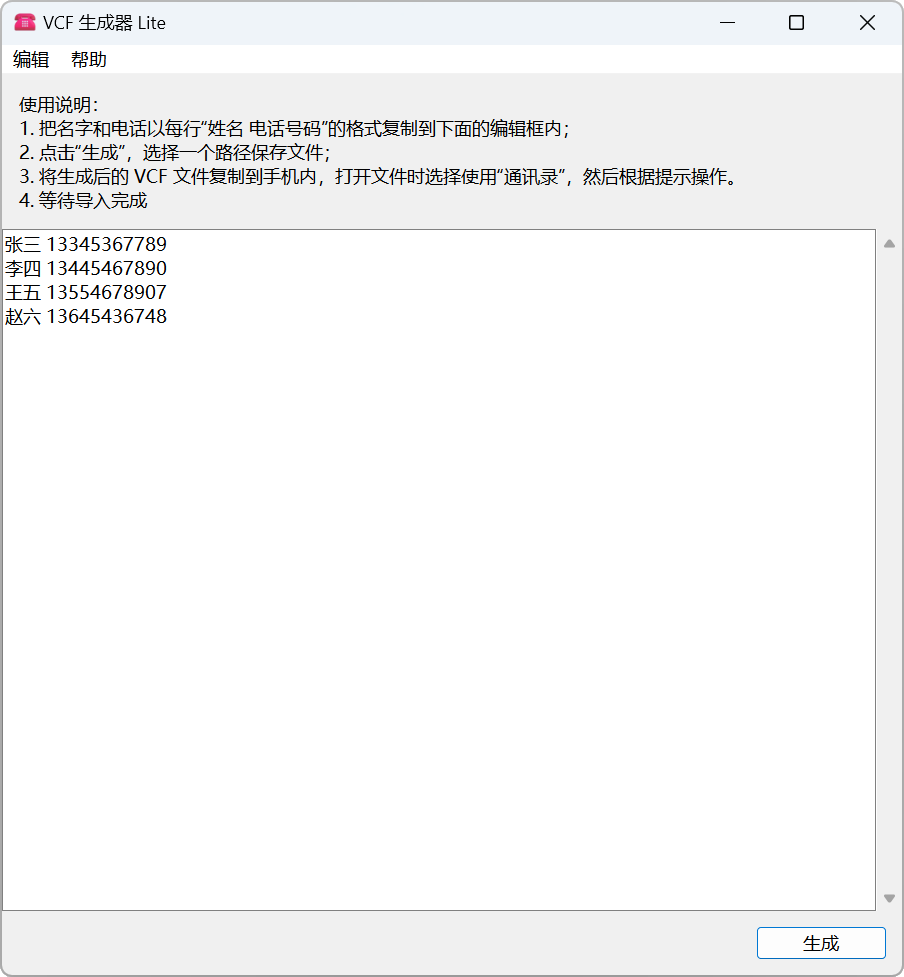

<div align="center">


# VCF Generator Lite

[](https://gitee.com/HelloTool/VCFGeneratorLiteForTkinter)

[][ReleaseInGitee]

[中文](./README.zh.md) |
**English** |
<small>More translations are welcome!</small>

_The application currently only supports Chinese language_

</div>

VCF generator, input name and phone number to automatically generate VCF files for batch import into the address book.

[](./LICENSE)
[](./CODE_OF_CONDUCT.md)

## Screenshot



## Usage

Go to the [Release][ReleaseInGitee] to download and run the installation program (file name is usually
`VCFGenerator_<Version>_<PythonVersion>_<Architecture>_64bit_setup.exe`).

1. Copy the name and phone number in the format of `name  phone_number` on each line into the editing box below;
   ```text
   Hardy Buck 13445467890
   Alva Mackintosh 13554678907
   Hobart Baker 13645436748
   ```
2. Click "Generate", select a path to save the file;
3. Copy the generated VCF file to your phone, select "Address Book" when opening the file, and then follow the prompts.
4. Wait for import to complete

> [!TIP]
>
> - Tabs will be automatically converted to spaces for processing.
> - The program will automatically remove excess spaces from the input box.
> - If there are multiple spaces in each line, all characters before the last space will be treated as names.\
    > For example, `Hardy Buck 13333333333` will be recognized as
    >   ```text
>   Name: Hardy Buck
>   Phone: 13333333333
>   ```

> [!NOTE]
>
> If you need to use this software on Windows 7, please add or overwrite the `python313.dll` and
`api-ms-win-core-path-l1-1-0.dll` files compatible with Windows 7 in the
`_internal` folder of the software installation directory. You can download these two files from the [PythonWin7](https://github.com/adang1345/PythonWin7) repository.

## Project Structure

- `vcf_generator`: Source code directory
    - `console`: Developing CLI
    - `ui`: GUI
    - `util`: Tool classes
    - `widget`: Tkinter widget
    - `constants.py`: Constants
  - `assets`: Resource file directory
- `scripts`：Script directory
- `main.py`: Program entry

## Developing

The development environment currently only supports 64 bits Windows 8+ and does not currently support macOS and Linux.

This project defines a number of commands that you can view with `pdm run --list`.

### Pre-development

1. Install [Python 3.11+](https://www.python.org/), [PDM](https://pdm-project.org/zh-cn/latest/), [UPX](https://upx.github.io/), [InnoSetup 6.3](https://jrsoftware.org/isinfo.php);
2. Install dependencies: `pdm install`;
3. Install the PDM plugins: `pdm install --plugins`;
4. Download the InnoSetup file: `pdm run prepare_innosetup_extensions`。

### Building

1. Generate `file_version_info.txt`：`poetry run generate-version-file`;
2. Generate app binary: `poetry run build-app`;
3. Generate installer：`poetry run build-setup`.

### Change version

Run `poetry run change-version <Version>`.

## License

This project is open source under the [MIT license](./LICENSE)

- [Fluent Emoji](https://github.com/microsoft/fluentui-emoji)(used as application icon): MIT license
- [Python](https://www.python.org/): [Python license](https://docs.python.org/3/license.html)
- [UPX](https://upx.github.io/)(for compressing code): GPL-2.0 licenses
- [PyInstaller](https://pyinstaller.org/en/stable/)：[PyInstaller license](https://pyinstaller.org/en/stable/license.html)
- [tkhtmlview](https://github.com/bauripalash/tkhtmlview): MIT License

## Contribute

See [Contribution Guidelines](./CONTRIBUTING.zh.md).

[ReleaseInGitee]: https://gitee.com/HelloTool/VCFGeneratorLiteForTkinter/releases/latest
