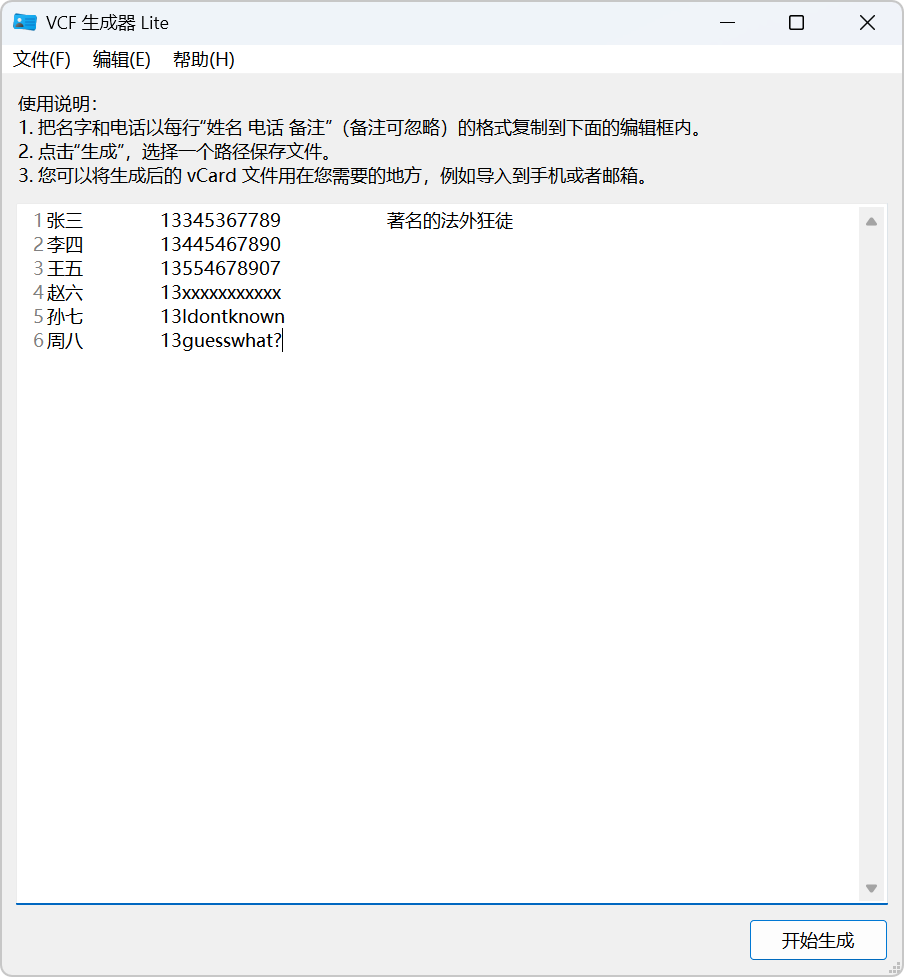
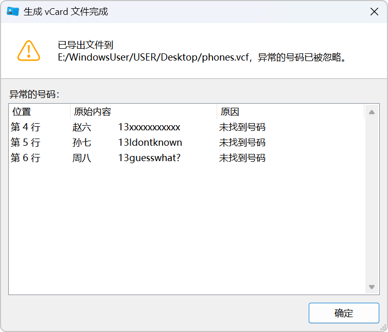

<div align="center">


# VCF Generator Lite 

**Repositories**:
[][repository-gitee]
[][repository-github]

**Platforms**:
[][release-gitee]
[][release-gitee]

**Languages**:
[简体中文](./README.zh-CN.md) |
**English** |
<small>More translations are welcome!</small>

</div>

VCF Generator Lite can convert a contact list into a single vCard file, which can be batch-imported into mobile phone contacts or used for other purposes.

[](./LICENSE)
[](./CODE_OF_CONDUCT.md)

[](https://github.com/hellotool/VCFGeneratorLiteWithTkinter/actions/workflows/test.yml)

## Features

- **Smart Parsing**: Batch contacts in `Name Phone Note` format (note optional), automatically handles tabs and spaces.
- **Batch Generation**: Combines all contacts into a single `.vcf` file.
- **Number Validation**: Automatically skips invalid numbers and quickly locates error rows.
- **Editing Assistance**: Displays line numbers in text area, supports one-click quote removal.

## Screenshots




## Getting the App

### Downloading the Packages

You can download the package through the following channels:

- [Gitee Releases][release-gitee]
- [GitHub Releases][release-github]

Please select the appropriate software package for your platform:

| Platform       | Package Type           | Installation Required | File                                                      |
| -------------- | ---------------------- | --------------------- | --------------------------------------------------------- |
| Windows        | Installer              | Yes                   | VCFGeneratorLite-\<version\>-**win-amd64**-*setup.exe*    |
| Windows        | Portable Version       | No                    | VCFGeneratorLite-\<version\>-**win-amd64**-*portable.zip* |
| Cross-platform | Python Wheel           | Optional              | vcf_generator_lite-\<version\>-**py3-none-any**.*whl*     |
| Cross-platform | Python ZIP Application | No                    | VCFGeneratorLite-\<version\>-**py3**.*pyzw*               |

### Using the Python Wheel

There are several ways to use a Python Wheel file. Below is an example using the [uv tool][uv-homepage].

**Install into the system environment**:

```bash
uv tool install <path to whl file>
```

After installation, you can run it with:

```bash
uv tool run vcf-generator-lite
# or
vcf-generator-lite
```

**Run directly (without installing)**:

```bash
uvx <path to whl file>
```

## Usage

1. Copy the name and phone number in the format of `Name Phone Note` on each line into the text field below. The note can be omitted.
   ```text
   Isaac Newton	13445467890	British mathematician
   Muhammad		13554678907
   Confucius		13645436748
   ```
2. Click **Generate**, select a path to save the file.
3. You can use the generated vCard file wherever you need it. For details, please refer to [Using vCard Files](#using-vcard-files) below.

> [!NOTE]
>
> - You can use both tabs and spaces to separate the name and phone number.
> - The program will automatically remove extra spaces from the text field.
>
> For example, ` Han Meimei   13333333333   A   well-known girl` will be recognized as
>
>
> > - Name: Han Meimei
> > - Phone: 13333333333
> > - Note: A well-known girl
>

### Using vCard Files

<details>
<summary>Import to Mobile Contacts</summary>

1. Transfer the vCard file to your phone.
2. Open the vCard file and select **Contacts**, then follow the prompts.
3. Wait for the import to complete.

</details>

<details>
<summary>Import to QQ Mail</summary>

1. Open the new version of the QQ Mail website.
2. In the sidebar, select **Apps > Contacts**, then choose **Manage > Import contacts**.
3. In the dialog box that appears, click the **Select File** button and select your vCard file.
4. Click **Start to import**.

</details>

<details>
<summary>Import to Lark</summary>

1. Open the Lark client.
2. In the sidebar, select **Contacts > Email Contacts**, then choose the **Add > Import contacts** button.
3. In the dialog box that appears, select or drag your vCard file.
4. Click **Import**.

</details>

## Compatibility

### System Requirements

| Software Package Type        | System Requirements           |
| ---------------------------- | ----------------------------- |
| Windows Installer & Portable | Windows 8.1 or later          |
| Python ZIP Application       | Python 3.12 or later, Tkinter |

If you wish to use this application on Windows 8 or earlier versions, please see [Running on Older Windows](./docs/compatibility/runs-on-older-windows.md).

On Windows systems, to launch the Python Zip Application by double-clicking, you need to install either the [Python Launcher][pylauncher] or [Python Install Manager][pymanager].

### Features Compatibility

| System Environment  | Feature         | Details                                                            |
| ------------------- | --------------- | ------------------------------------------------------------------ |
| Windows 10 or later | Dark Mode       | Dark mode not supported                                            |
| Windows 10 or later | Display Scaling | Display scaling adaptation is handled by the OS when switching DPI |

If you want to use dark mode in Windows, you can [enable high contrast mode][windows-high-contrast-support], or use [Rectify11][rectify11] or other third-party tools to modify the system theme.

### File Compatibility

- **vCard Version**: 2.1
- **Supported Fields**: Name, Phone Number, Note
- **Known Issues**:
  - **Windows Contacts**: May display garbled characters in non-UTF-8 environments.

## License

This project is licensed under the Apache 2.0 license. For details, please refer to the [LICENSE file](./LICENSE).

```txt
Copyright 2023-2026 Jesse205

Licensed under the Apache License, Version 2.0 (the "License");
you may not use this file except in compliance with the License.
You may obtain a copy of the License at

    http://www.apache.org/licenses/LICENSE-2.0

Unless required by applicable law or agreed to in writing, software
distributed under the License is distributed on an "AS IS" BASIS,
WITHOUT WARRANTIES OR CONDITIONS OF ANY KIND, either express or implied.
See the License for the specific language governing permissions and
limitations under the License.
```

## Credits

- **AI Coding Assistants**: Parts of the code and test code in this project were generated with the assistance of AI coding assistants.
  - DeepSeek
  - Tongyi Lingma
- **Open Source Code**: This project uses some open source code. For details, please see [Open Source Notices (Chinese)](./docs/legal/os-notices.md).

## More Documentation

- [Development Guide (Chinese)](./docs/dev/index.md)
- [Contribution Guide (Chinese)](./CONTRIBUTING.md)
- [FAQ (Chinese)](./docs/faq.md)

[repository-gitee]: https://gitee.com/hellotool/VCFGeneratorLiteWithTkinter/
[repository-github]: https://github.com/hellotool/VCFGeneratorLiteWithTkinter/
[release-gitee]: https://gitee.com/hellotool/VCFGeneratorLiteWithTkinter/releases/latest
[release-github]: https://github.com/hellotool/VCFGeneratorLiteWithTkinter/releases/latest
[pylauncher]: https://docs.python.org/zh-cn/3.15/using/windows.html#python-launcher-for-windows-deprecated
[pymanager]: https://docs.python.org/zh-cn/3.15/using/windows.html#python-install-manager
[windows-high-contrast-support]: https://support.microsoft.com/en-us/windows/turn-high-contrast-mode-on-or-off-in-windows-909e9d89-a0f9-a3a9-b993-7a6dcee85025
[rectify11]: https://www.rectify11.com/
[uv-homepage]: https://docs.astral.sh/uv/
