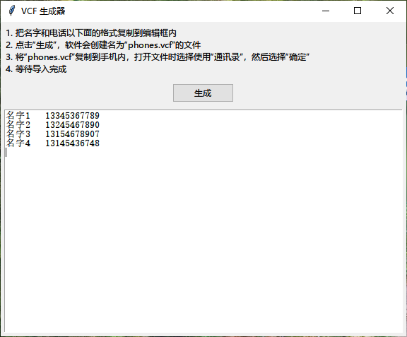

# VCF 生成器 Lite


VCF 生成器，输入姓名与手机号则自动生成用于批量导入的 VCF 文件。

## 软件截图



## 使用方法

使用 Python 解析器运行 `vcf生成器.pyw` 或者运行发行版根目录中 `启动vcf生成器.bat` 即可启动程序

1. 把名字和电话以下面的格式复制到编辑框内。
   ```text
   名字1	13345367789
   名字2	13245467890
   名字3	13154678907
   名字4	13145436748
   ```
2. 点击“生成”，软件会创建名为 `phones.vcf` 的文件。
3. 将 `phones.vcf` 复制到手机内，打开文件时选择使用“通讯录”，然后选择“确定”。
4. 等待导入完成。

> [!TIP]
>
> - 制表符将会自动转换为空格处理。
> - 程序会自动去除输入框内多余的空格。
> - 如果每行有多个空格，则会将最后一个空格以前所有的字符当作姓名处理。
>   比如 `Wang lei 13333333333` 将会识别为
>   ```text
>   姓名：Wang lei
>   电话：13333333333
>   ```

## 软件架构

- `vcf生成器.pyw`：入口文件。

## 构建项目

直接运行 `build.bat`。

> [!WARNING]\
> 由于未知原因，打包为单个文件会导致运行时非常慢。因此建议不要打包为单个文件。
