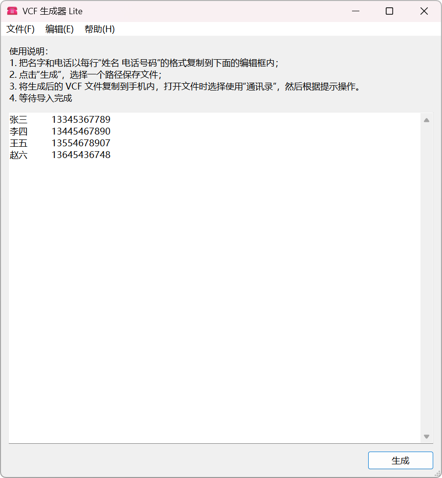

<div align="center">


# VCF 生成器 Lite

**仓库：**
[][RepositoryOnGitee]
[][RepositoryOnGithub]

**平台：**
[][ReleaseOnGitee]
[][ReleaseOnGitee]

**语言：**
**中文** |
[English](./README.md) |
<small>期待你的翻译！</small>

_该应用程序目前仅支持中文。_

</div>

VCF 生成器，输入姓名与手机号则自动生成用于批量导入到通讯录内的 VCF 文件。

[](./LICENSE)
[](./CODE_OF_CONDUCT.zh.md)

## 软件截图



## 环境要求

- `VCFGenerator_<版本>_<位数>_setup.exe`、`VCFGenerator_<版本>_<位数>_portable_windows.zip`
  - 操作系统：Windows 8+ 或 Windows 7+（伴随补丁）
  - CPU：x86 64位
- `vcf_generator.pyzw`
  - 操作系统：Windows 8+ 或 Windows 7+（伴随补丁）（其他操作系统暂不支持）
  - Python 版本：Python 3.13（伴随 Tkinter）

对于部分系统，您可以通过修补软件的方法支持运行此应用。如需在这些系统中运行此应用，请参考[修补应用](#修补应用)章节。

### 修补应用

<details>
<summary>支持 Windows 7 运行</summary>

1. 下载兼容 Windows 7 的 `python313.dll` 与 `api-ms-win-core-path-l1-1-0.dll`；
    - 您可以选择到 [PythonWin7][PythonWin7RepositoryOnGithub] 仓库中下载这两个文件。
2. 安装软件，进入安装目录中 `_internal`，覆盖以上两个 DLL。

</details>

## 使用方法

1. 进入[发行版][ReleaseOnGitee]下载并安装 APP；
2. 打开 APP；
3. 把名字和电话以每行 `姓名 电话号码` 的格式复制到下面的编辑框内；
    ```text
    李四	13445467890
    王五	13554678907
    赵六	13645436748
    ```
4. 点击“生成”，选择一个路径保存文件；
5. 将生成后的 VCF 文件复制到手机内，打开文件时选择使用“通讯录”，然后根据提示操作；
6. 等待导入完成。

> [!NOTE]
>
> - 制表符将会自动转换为空格处理。
> - 程序会自动去除输入框内多余的空格。
> - 如果每行有多个空格，则会将最后一个空格以前所有的字符当作姓名处理。
>
> 比如 ` Wang lei   13333333333   ` 将会被识别为
>
> ```text
> 姓名：Wang lei
> 电话：13333333333
> ```

## 开发与贡献

请参阅[《开发指南》](./docs/dev/README.md)与[《贡献指南》](./CONTRIBUTING.zh.md)。

[RepositoryOnGitee]: https://gitee.com/HelloTool/VCFGeneratorLiteForTkinter/
[RepositoryOnGithub]: https://github.com/HelloTool/VCFGeneratorLiteForTkinter/
[ReleaseOnGitee]: https://gitee.com/HelloTool/VCFGeneratorLiteForTkinter/releases/latest
[ReleaseOnGithub]: https://github.com/HelloTool/VCFGeneratorLiteForTkinter/releases/latest
[PythonWin7RepositoryOnGithub]: https://github.com/adang1345/PythonWin7
